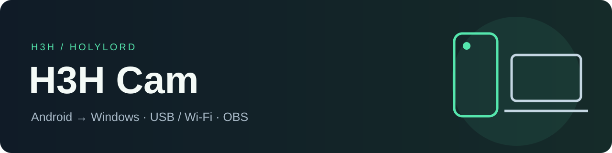

# Камера телефона для Windows и OBS

**H3H Cam** превращает Android-телефон в управляемую камеру для стримов, видеозвонков и записи. Windows-клиент выбирает модуль камеры и параметры потока; телефон захватывает и аппаратно кодирует видео.

[**Скачать Windows + APK**](https://github.com/H3H-holylord/H3H-Cam/releases/latest) · [Быстрый старт](docs/QUICKSTART.md) · [Сборка](docs/BUILD.md) · [Сообщить о проблеме](https://github.com/H3H-holylord/H3H-Cam/issues)

## Возможности

- H.264 / HEVC, разрешение, 30/60 FPS и битрейт. 1080p60 проверен на Samsung Note9; режимы зависят от камеры и прошивки.
- USB через ADB reverse; Wi-Fi через RTP/UDP; USB Direct/AOA при совместимом устройстве и драйвере WinUSB.
- Камеры, фокус, экспозиция, WB, зум, стабилизация и автокадр — по возможностям устройства.
- Отключаемый предпросмотр, Spout2 для OBS и виртуальная камера для приложений.
- Foreground service, погашение экрана, переподключение, статистика FPS/битрейта и батареи.
- Общий декодер для Spout2 и предпросмотра, пауза скрытого предпросмотра и ускоренная обработка цвета/NV12: [проверка CPU](docs/PERFORMANCE.md).
- Отдельный видеопоток MMCSS Capture, независимый предпросмотр, ограниченная очередь Spout и восстановление зависшего декодера: [проверка под нагрузкой](docs/GAME-LOAD.md).
- Исправлен повторный поворот изображения в OBS; проверены GPU-цвет, NV12 и обновление Antigravity: [отчёт 4.0.8](docs/ANTIGRAVITY-REVIEW-4.0.8.md).

## Скачать

| Файл | Назначение |
|---|---|
| [Windows x64 ZIP](https://github.com/H3H-holylord/H3H-Cam/releases/download/v4.0.8/H3H-Cam-4.0.8-Windows-x64.zip) | Клиент 4.0.8, .NET runtime включён |
| [Android APK](https://github.com/H3H-holylord/H3H-Cam/releases/download/v4.0.8/H3H-Cam-4.0.4.apk) | Android 4.0.4, Android 8+ |
| [SHA256](https://github.com/H3H-holylord/H3H-Cam/releases/download/v4.0.8/SHA256SUMS.txt) | Проверка скачанных файлов |

FFmpeg/FFplay, ADB и OBS устанавливаются отдельно. Клиент ищет их автоматически или принимает указанные пути. AI-эффекты требуют дополнительных совместимых весов; модель не входит в публичный релиз.

## Начать работу

1. Установите APK и разрешите камеру на телефоне.
2. Распакуйте Windows ZIP. Установите FFmpeg, для ADB-режимов — Android Platform Tools.
3. Подключите USB, включите отладку и подтвердите доступ компьютера на телефоне. В клиенте выберите USB → НАЙТИ → СТАРТ.
4. В OBS добавьте Spout2 Capture с сендером H3HCam. Нужен отдельно установленный плагин Spout2.

Подробная инструкция: [docs/QUICKSTART.md](docs/QUICKSTART.md).

## Ограничения

60 FPS и 4K доступны не на каждой камере. Задержка зависит от захвата, декодирования, сети и нагрузки CPU/GPU; приоритет процесса не резервирует GPU. Звук с телефона не передаётся — используйте обычный микрофон. Wi-Fi/ADB рассчитаны на доверенную LAN; не открывайте управляющие порты в интернет.

## Разработка

`android/` — захват и кодек; `windows/` — .NET 8 WPF и вывод видео; `tests/` — тесты; `docs/` — инструкции. Ключи подписи, настройки AppData и личные логи исключены.

**GPL-3.0.** Сторонние компоненты сохраняют свои лицензии: [THIRD_PARTY.md](THIRD_PARTY.md).

Автор: [H3H / HolyLord](https://github.com/H3H-holylord).
